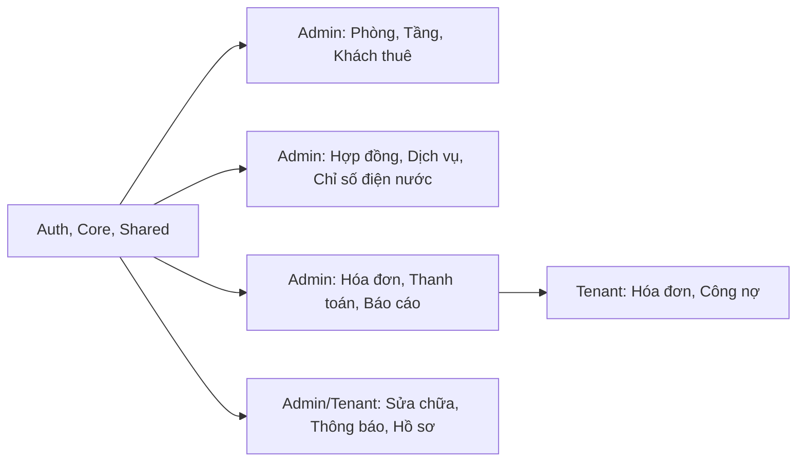

# Phân chia nhiệm vụ nhóm - Smart Rental Management System

> **Dự án:** Hệ thống quản lý cho thuê phòng trọ - Lumina Resident  
> **Stack:** Flutter Web, Spring Boot, MySQL  
> **Tổng thành viên:** 5 người  
> **Mục tiêu:** Chia theo domain nghiệp vụ, mỗi người có frontend + backend + checklist rõ ràng, hạn chế đụng chạm file của nhau.

---

## Tổng quan module hệ thống

---

## Thành viên 1 - Auth, Core & Shared Infrastructure

> **Vai trò:** Làm nền tảng dùng chung: đăng nhập, phân quyền, router, theme, API client, shared widgets.  
> **Lưu ý:** Các file shared có thể bị nhiều người cần sửa, thành viên 1 là owner/reviewer chính.

### Frontend

| Nhóm file | File/thư mục | Mô tả |
|---|---|---|
| Auth UI | [`frontend/lib/presentation/auth/`](frontend/lib/presentation/auth/) | Login, splash, quên mật khẩu, đặt lại mật khẩu, đổi mật khẩu |
| Auth state | [`frontend/lib/presentation/auth/auth_controller.dart`](frontend/lib/presentation/auth/auth_controller.dart) | Quản lý trạng thái đăng nhập, logout, forgot/reset password |
| API core | [`frontend/lib/data/api/`](frontend/lib/data/api/) | Dio client, interceptor, ApiResponse, ApiException |
| Auth repository/model | [`frontend/lib/data/repositories/auth_repository.dart`](frontend/lib/data/repositories/auth_repository.dart), [`frontend/lib/data/models/auth_models.dart`](frontend/lib/data/models/auth_models.dart) | Gọi API auth và map dữ liệu auth |
| Router | [`frontend/lib/core/router/app_router.dart`](frontend/lib/core/router/app_router.dart) | Guard route admin/tenant, redirect login |
| Theme | [`frontend/lib/core/theme/`](frontend/lib/core/theme/) | Light/dark theme, lưu theme sau reload |
| Shared widgets | [`frontend/lib/presentation/shared/`](frontend/lib/presentation/shared/) | AppCard, StatusChip, EmptyState, LoadingShimmer, error screens |
| Utils/constants | [`frontend/lib/core/constants/`](frontend/lib/core/constants/), [`frontend/lib/core/utils/`](frontend/lib/core/utils/) | Màu sắc, text style, format tiền/ngày |

### Backend

| Module | Mô tả |
|---|---|
| [`backend/src/main/java/com/example/rentalmanagement/auth/`](backend/src/main/java/com/example/rentalmanagement/auth/) | Login, forgot/reset password, change password, `/auth/me` |
| [`backend/src/main/java/com/example/rentalmanagement/common/security/`](backend/src/main/java/com/example/rentalmanagement/common/security/) | JWT, security filter, SecurityConfig |
| [`backend/src/main/java/com/example/rentalmanagement/common/api/`](backend/src/main/java/com/example/rentalmanagement/common/api/) | ApiResponse, ErrorResponse, PageResponse |
| [`backend/src/main/java/com/example/rentalmanagement/common/exception/`](backend/src/main/java/com/example/rentalmanagement/common/exception/) | Exception handler, BusinessException, UnauthorizedException |
| [`backend/src/main/java/com/example/rentalmanagement/user/`](backend/src/main/java/com/example/rentalmanagement/user/) | User, Role, admin user account APIs |

### Checklist

- [ ] Login/logout đúng role admin/tenant.
- [ ] Quên mật khẩu: validate tài khoản/email không tồn tại, không hiển thị token trên UI.
- [ ] Đổi mật khẩu: validate mật khẩu cũ, mật khẩu mới, confirm password.
- [ ] Token hết hạn hoặc 401 redirect về login.
- [ ] Theme sáng/tối được lưu sau reload.
- [ ] Shared widgets dùng được ở cả light/dark mode.
- [ ] Test API: `/auth/login`, `/auth/me`, `/auth/change-password`, `/auth/forgot-password`, `/auth/reset-password`.

---

## Thành viên 2 - Admin: Phòng, Tầng, Tòa nhà & Khách thuê

> **Vai trò:** Quản lý tài sản phòng trọ và hồ sơ khách thuê ở phía admin.

### Frontend

| File/thư mục | Mô tả |
|---|---|
| [`frontend/lib/presentation/admin/room_management_screen.dart`](frontend/lib/presentation/admin/room_management_screen.dart) | Danh sách phòng, thêm phòng, tìm kiếm, lọc trạng thái |
| [`frontend/lib/presentation/admin/room_detail_screen.dart`](frontend/lib/presentation/admin/room_detail_screen.dart) | Chi tiết phòng, trạng thái phòng, thông tin hợp đồng hiện tại |
| [`frontend/lib/presentation/admin/tenant_management_screen.dart`](frontend/lib/presentation/admin/tenant_management_screen.dart) | Danh sách khách thuê, thêm khách, xem chi tiết |
| [`frontend/lib/data/models/room_models.dart`](frontend/lib/data/models/room_models.dart) | Model Building, Floor, Room, RoomRequest |
| [`frontend/lib/data/models/tenant_models.dart`](frontend/lib/data/models/tenant_models.dart) | Model TenantProfile, TenantRequest |
| [`frontend/lib/data/repositories/admin_repository.dart`](frontend/lib/data/repositories/admin_repository.dart) | Owner các hàm buildings/floors/rooms/tenants/users |
| [`frontend/lib/presentation/admin/admin_controller.dart`](frontend/lib/presentation/admin/admin_controller.dart) | Owner `AdminRoomsNotifier`, `AdminTenantsNotifier` |

### Backend

| Module | Mô tả |
|---|---|
| [`backend/src/main/java/com/example/rentalmanagement/building/`](backend/src/main/java/com/example/rentalmanagement/building/) | Building, Floor, PropertyController, PropertyService |
| [`backend/src/main/java/com/example/rentalmanagement/room/`](backend/src/main/java/com/example/rentalmanagement/room/) | Room entity, RoomRequest, RoomRepository |
| [`backend/src/main/java/com/example/rentalmanagement/tenant/`](backend/src/main/java/com/example/rentalmanagement/tenant/) | TenantProfile, Occupant, tenant repositories/dto |

### Checklist

- [ ] Thêm phòng: validate số phòng trùng, diện tích, giá thuê, tiền cọc, số người tối đa.
- [ ] Lọc phòng theo `AVAILABLE`, `OCCUPIED`, `MAINTENANCE`, `INACTIVE`.
- [ ] Tìm kiếm phòng theo số phòng/tòa nhà/tầng.
- [ ] Chi tiết phòng hiển thị đúng khách thuê/hợp đồng đang active.
- [ ] Thêm khách thuê: validate email, số điện thoại, CCCD/CMND trùng.
- [ ] Khóa/mở khóa tài khoản khách thuê nếu có.
- [ ] Pagination danh sách phòng và khách thuê.
- [ ] UI phòng/khách dùng theme và shared widgets.

---

## Thành viên 3 - Admin: Hợp đồng, Dịch vụ & Chỉ số điện nước

> **Vai trò:** Quản lý vòng đời hợp đồng, dịch vụ tính tiền và chỉ số điện/nước.

### Frontend

| File/thư mục | Mô tả |
|---|---|
| [`frontend/lib/presentation/admin/contract_management_screen.dart`](frontend/lib/presentation/admin/contract_management_screen.dart) | Danh sách hợp đồng, lọc trạng thái, chấm dứt hợp đồng |
| [`frontend/lib/presentation/admin/create_contract_screen.dart`](frontend/lib/presentation/admin/create_contract_screen.dart) | Tạo hợp đồng mới |
| [`frontend/lib/presentation/admin/meter_reading_screen.dart`](frontend/lib/presentation/admin/meter_reading_screen.dart) | Ghi chỉ số điện/nước |
| [`frontend/lib/data/models/contract_models.dart`](frontend/lib/data/models/contract_models.dart) | Model hợp đồng |
| [`frontend/lib/data/models/meter_reading_models.dart`](frontend/lib/data/models/meter_reading_models.dart) | Model chỉ số |
| [`frontend/lib/data/models/service_models.dart`](frontend/lib/data/models/service_models.dart) | Model dịch vụ/giá dịch vụ |
| [`frontend/lib/data/repositories/admin_repository.dart`](frontend/lib/data/repositories/admin_repository.dart) | Owner các hàm contracts, services, meter-readings |
| [`frontend/lib/presentation/admin/admin_controller.dart`](frontend/lib/presentation/admin/admin_controller.dart) | Owner `AdminContractsNotifier` và các provider hợp đồng/chỉ số |

### Backend

| Module | Mô tả |
|---|---|
| [`backend/src/main/java/com/example/rentalmanagement/contract/`](backend/src/main/java/com/example/rentalmanagement/contract/) | RentalContract, ContractController, ContractManagementService |
| [`backend/src/main/java/com/example/rentalmanagement/meterreading/`](backend/src/main/java/com/example/rentalmanagement/meterreading/) | MeterReading, MeterReadingRequest, repository |
| [`backend/src/main/java/com/example/rentalmanagement/serviceitem/`](backend/src/main/java/com/example/rentalmanagement/serviceitem/) | ServiceItem, ServicePrice, service price APIs |

### Checklist

- [ ] Tạo hợp đồng: chỉ cho chọn phòng `AVAILABLE`.
- [ ] Tạo hợp đồng xong cập nhật trạng thái phòng/hợp đồng đúng.
- [ ] Lọc hợp đồng theo `ACTIVE`, `EXPIRED`, `TERMINATED`, `CANCELLED`.
- [ ] Cảnh báo hợp đồng sắp hết hạn.
- [ ] Chấm dứt hợp đồng: nhập lý do, cập nhật trạng thái hợp đồng.
- [ ] Ghi chỉ số: lấy chỉ số cũ theo đúng phòng + đúng dịch vụ.
- [ ] Ghi chỉ số: validate chỉ số mới >= chỉ số cũ.
- [ ] Ghi chỉ số: không cho trùng phòng/dịch vụ/tháng/năm.
- [ ] Service điện/nước lấy từ backend, không hard-code id.

---

## Thành viên 4 - Admin: Hóa đơn, Thanh toán, Công nợ & Báo cáo

> **Vai trò:** Phần tài chính: sinh hóa đơn, phát hành, thanh toán, công nợ, doanh thu.  
> **Lưu ý:** Đây là module phức tạp nhất, cần phối hợp với thành viên 3 về chỉ số điện/nước.

### Frontend

| File/thư mục | Mô tả |
|---|---|
| [`frontend/lib/presentation/admin/invoice_management_screen.dart`](frontend/lib/presentation/admin/invoice_management_screen.dart) | Danh sách hóa đơn, lọc, sinh hóa đơn, chi tiết, thanh toán |
| [`frontend/lib/presentation/admin/revenue_report_screen.dart`](frontend/lib/presentation/admin/revenue_report_screen.dart) | Biểu đồ doanh thu |
| [`frontend/lib/presentation/admin/admin_dashboard_screen.dart`](frontend/lib/presentation/admin/admin_dashboard_screen.dart) | Dashboard admin: doanh thu, công nợ, hợp đồng sắp hết hạn, yêu cầu chờ xử lý |
| [`frontend/lib/presentation/tenant/invoice_detail_screen.dart`](frontend/lib/presentation/tenant/invoice_detail_screen.dart) | Tenant xem chi tiết hóa đơn |
| [`frontend/lib/data/models/invoice_models.dart`](frontend/lib/data/models/invoice_models.dart) | Model invoice, invoice detail, item |
| [`frontend/lib/data/models/payment_models.dart`](frontend/lib/data/models/payment_models.dart) | Model payment |
| [`frontend/lib/data/models/admin_models.dart`](frontend/lib/data/models/admin_models.dart) | Model dashboard summary |
| [`frontend/lib/data/repositories/admin_repository.dart`](frontend/lib/data/repositories/admin_repository.dart) | Owner các hàm dashboard, invoices, payments, debts |
| [`frontend/lib/presentation/admin/admin_controller.dart`](frontend/lib/presentation/admin/admin_controller.dart) | Owner dashboard providers và `AdminInvoicesNotifier` |

### Backend

| Module | Mô tả |
|---|---|
| [`backend/src/main/java/com/example/rentalmanagement/invoice/`](backend/src/main/java/com/example/rentalmanagement/invoice/) | BillingController, BillingService, Invoice, InvoiceItem |
| [`backend/src/main/java/com/example/rentalmanagement/payment/`](backend/src/main/java/com/example/rentalmanagement/payment/) | Payment entity, payment dto/repository |
| [`backend/src/main/java/com/example/rentalmanagement/dashboard/`](backend/src/main/java/com/example/rentalmanagement/dashboard/) | DashboardController, DashboardService |

### Checklist

- [ ] Sinh hóa đơn hằng tháng: báo rõ nếu thiếu chỉ số điện/nước.
- [ ] Lọc hóa đơn theo tháng, năm, trạng thái.
- [ ] Phát hành hóa đơn từ `DRAFT`.
- [ ] Ghi nhận thanh toán: số tiền, ngày thanh toán, phương thức, ghi chú.
- [ ] Cập nhật trạng thái hóa đơn sau thanh toán: `PAID`, `PARTIALLY_PAID`, `OVERDUE`.
- [ ] Hủy hóa đơn: nhập lý do, không cho hủy nếu đã có thanh toán hợp lệ.
- [ ] Danh sách công nợ chưa thanh toán.
- [ ] Báo cáo doanh thu theo tháng/năm với biểu đồ.
- [ ] Tenant xem chi tiết hóa đơn và lịch sử thanh toán.
- [ ] Dashboard admin hiển thị đúng doanh thu, tổng nợ, phòng đang thuê, hợp đồng sắp hết hạn.

---

## Thành viên 5 - Sửa chữa, Thông báo & Tenant Experience

> **Vai trò:** Quản lý yêu cầu sửa chữa, thông báo, hồ sơ cá nhân và các màn tenant còn lại.  
> **Phạm vi đã giảm tải:** Tenant invoice detail chuyển sang thành viên 4 để cân bằng module tài chính.

### Frontend

| File/thư mục | Mô tả |
|---|---|
| [`frontend/lib/presentation/admin/maintenance_management_screen.dart`](frontend/lib/presentation/admin/maintenance_management_screen.dart) | Admin tiếp nhận/xử lý/hoàn thành/từ chối yêu cầu sửa chữa |
| [`frontend/lib/presentation/tenant/home_screen.dart`](frontend/lib/presentation/tenant/home_screen.dart) | Trang chủ tenant |
| [`frontend/lib/presentation/tenant/maintenance_screen.dart`](frontend/lib/presentation/tenant/maintenance_screen.dart) | Tenant tạo, xem, hủy yêu cầu sửa chữa |
| [`frontend/lib/presentation/tenant/notifications_screen.dart`](frontend/lib/presentation/tenant/notifications_screen.dart) | Tenant xem và đánh dấu thông báo |
| [`frontend/lib/presentation/tenant/profile_screen.dart`](frontend/lib/presentation/tenant/profile_screen.dart) | Hồ sơ cá nhân tenant, đổi mật khẩu |
| [`frontend/lib/presentation/tenant/tenant_controller.dart`](frontend/lib/presentation/tenant/tenant_controller.dart) | Owner state tenant dashboard/profile/maintenance/notification |
| [`frontend/lib/data/models/maintenance_models.dart`](frontend/lib/data/models/maintenance_models.dart) | Model yêu cầu sửa chữa |
| [`frontend/lib/data/models/notification_models.dart`](frontend/lib/data/models/notification_models.dart) | Model thông báo |
| [`frontend/lib/data/repositories/tenant_repository.dart`](frontend/lib/data/repositories/tenant_repository.dart) | Owner tenant APIs: dashboard, profile, maintenance, notification |
| [`frontend/lib/data/repositories/notification_repository.dart`](frontend/lib/data/repositories/notification_repository.dart) | Owner notification APIs |
| [`frontend/lib/data/repositories/admin_repository.dart`](frontend/lib/data/repositories/admin_repository.dart) | Owner các hàm admin maintenance và notifications |
| [`frontend/lib/presentation/admin/admin_controller.dart`](frontend/lib/presentation/admin/admin_controller.dart) | Owner `AdminMaintenanceNotifier` |

### Backend

| Module | Mô tả |
|---|---|
| [`backend/src/main/java/com/example/rentalmanagement/maintenance/`](backend/src/main/java/com/example/rentalmanagement/maintenance/) | MaintenanceController, MaintenanceService, MaintenanceRequestEntity |
| [`backend/src/main/java/com/example/rentalmanagement/notification/`](backend/src/main/java/com/example/rentalmanagement/notification/) | NotificationController, NotificationService |
| [`backend/src/main/java/com/example/rentalmanagement/tenant/controller/TenantSelfController.java`](backend/src/main/java/com/example/rentalmanagement/tenant/controller/TenantSelfController.java) | Tenant self APIs: profile, current contract, history |

### Checklist

- [ ] Admin lọc yêu cầu theo `OPEN`, `RECEIVED`, `IN_PROGRESS`, `RESOLVED`, `REJECTED`, `CANCELLED`.
- [ ] Admin cập nhật trạng thái yêu cầu với nội dung ghi chú.
- [ ] Admin từ chối/hoàn thành phải có lý do/nội dung rõ ràng.
- [ ] Tenant tạo yêu cầu sửa chữa với title, description, priority.
- [ ] Tenant hủy yêu cầu khi còn `OPEN` hoặc `RECEIVED` nếu nghiệp vụ cho phép.
- [ ] Tenant home hiển thị đúng phòng, hợp đồng, hóa đơn gần nhất, yêu cầu sửa chữa gần đây.
- [ ] Tenant thông báo: danh sách, unread count, mark read, mark all read.
- [ ] Tenant profile hiển thị đúng email, phone, CCCD, địa chỉ, hợp đồng hiện tại.
- [ ] Dark mode nhất quán trên các màn tenant và maintenance.

---

## Bảng tổng hợp phân chia

| # | Thành viên | Phạm vi chính | Frontend chính | Backend chính | Độ phức tạp |
|---|---|---|:---:|:---:|:---:|
| 1 | Auth, Core & Shared | Đăng nhập, router, theme, API core, shared widgets | 13+ files | auth, security, common, user | 4/5 |
| 2 | Phòng & Khách thuê | Phòng, tầng, tòa nhà, khách thuê | 5+ files | building, room, tenant | 3/5 |
| 3 | Hợp đồng & Chỉ số | Hợp đồng, dịch vụ, chỉ số điện/nước | 6+ files | contract, meterreading, serviceitem | 4/5 |
| 4 | Hóa đơn & Báo cáo | Hóa đơn, thanh toán, công nợ, dashboard, tenant invoice | 6+ files | invoice, payment, dashboard | 5/5 |
| 5 | Sửa chữa & Tenant | Maintenance, notifications, tenant home/profile | 8+ files | maintenance, notification, TenantSelf | 4/5 |

---

## Quy ước phối hợp nhóm

> **Quan trọng:** Các file dùng chung có owner rõ ràng, nhưng mọi người vẫn có thể sửa khi cần. Nếu sửa file shared, phải thông báo owner để review.

### File dễ bị xung đột

| File | Owner | Quy ước |
|---|---|---|
| [`frontend/lib/presentation/admin/admin_controller.dart`](frontend/lib/presentation/admin/admin_controller.dart) | Chia theo section | Chỉ sửa section mình phụ trách |
| [`frontend/lib/data/repositories/admin_repository.dart`](frontend/lib/data/repositories/admin_repository.dart) | Chia theo method group | Thêm API vào đúng group: rooms/tenants/contracts/invoices/maintenance |
| [`frontend/lib/core/router/app_router.dart`](frontend/lib/core/router/app_router.dart) | Thành viên 1 | Thêm route mới phải báo thành viên 1 |
| [`frontend/lib/presentation/shared/widgets/`](frontend/lib/presentation/shared/widgets/) | Thành viên 1 | Không sửa style global tùy tiện |
| [`backend/src/main/java/com/example/rentalmanagement/common/`](backend/src/main/java/com/example/rentalmanagement/common/) | Thành viên 1 | Sửa response/security/exception cần review chung |

### Quy ước code

- Theme: ưu tiên `Theme.of(context).colorScheme.*`, hạn chế màu hard-code.
- AppBar: dùng AppBar mặc định, chỉ custom khi thật sự cần.
- Card: ưu tiên `AppCard`.
- Status: ưu tiên `StatusChip`.
- Loading: dùng `PageLoading` / `CardShimmer`.
- Empty/error: dùng `EmptyState` / `ErrorState`.
- Routing: dùng `AppRoutes.*`, không hard-code route string trong UI.
- API: gọi qua repository, không gọi Dio trực tiếp trong screen.
- Backend response: giữ format `ApiResponse` / `ErrorResponse`.
- Pagination: mọi danh sách dài phải có page/size và loading more.

### Branch và commit

- Mỗi người tạo branch riêng:
  - `feature/member1-auth-core`
  - `feature/member2-room-tenant`
  - `feature/member3-contract-meter`
  - `feature/member4-invoice-report`
  - `feature/member5-maintenance-tenant`
- Commit message nên ngắn gọn theo format:
  - `feat(auth): add forgot password flow`
  - `fix(invoice): apply month and status filters`
  - `ui(tenant): polish profile dark mode`
- Trước khi merge:
  - Frontend: `flutter analyze` và `flutter build web`
  - Backend: `mvn test`
  - Test thủ công màn hình/phiên API mình phụ trách.

---

## Tiêu chí hoàn thành

Một task được xem là xong khi:

- [ ] UI hiển thị đúng ở light và dark mode.
- [ ] Form có validate và hiển thị lỗi dễ hiểu.
- [ ] API trả lời đúng, có xử lý lỗi ở frontend.
- [ ] Danh sách có loading/empty/error state.
- [ ] Refresh/reload trang không mất state quan trọng như auth/theme.
- [ ] Không làm vỡ route hoặc role guard admin/tenant.
- [ ] Đã test ít nhất 1 luồng thành công và 1 luồng lỗi.
